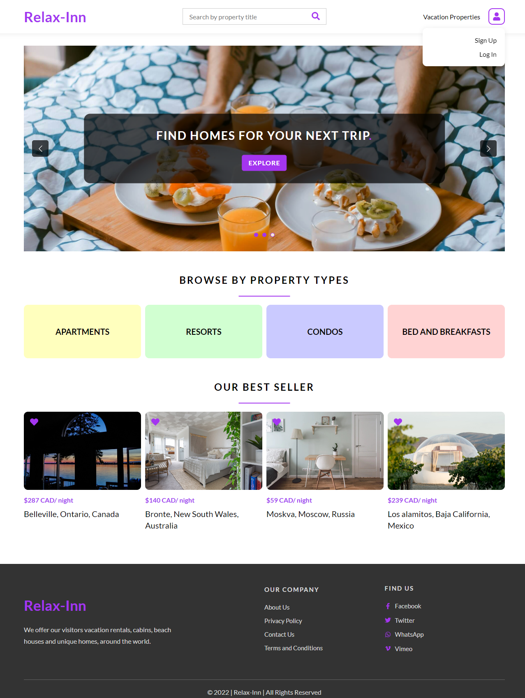
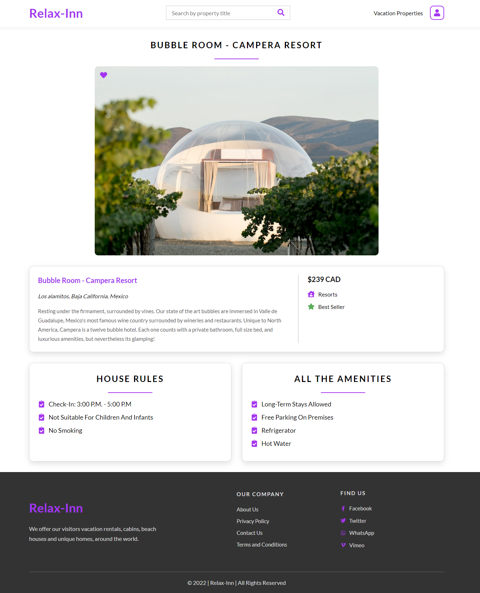
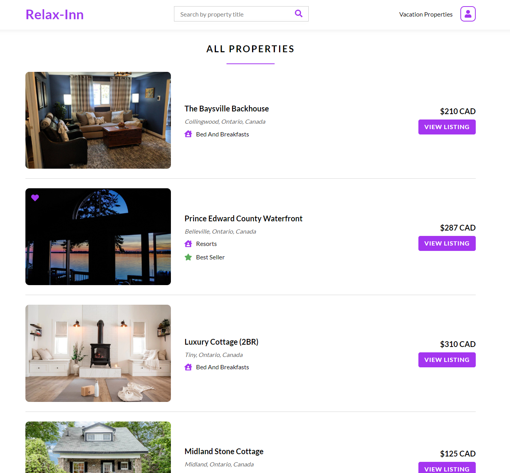

# Front End Project Using React JS 
- A website made made using [React JS Library](https://reactjs.org/) for a fake vacation rentals business
- This project was bootstrapped with [Create React App](https://github.com/facebook/create-react-app)
- It consumes a [RESTful API](https://relax-inn-api-spring-boot.herokuapp.com/)
- *Please Note:* This project & API project are deployed on Netlify & Heroku respectively, hence it might take a minute to load.

## Check out the website
Access the website at [Relax-Inn](https://relax-inn-by-manali.netlify.app/)

## Available Scripts

Download or Clone the repository, in the project directory, you can run:

### `npm install`
Installs all the necessary node modules in your repo.

### `npm start`

Runs the app in the development mode.\
Open [http://localhost:3000](http://localhost:3000) to view it in your browser.

The page will reload when you make changes.\
You may also see any lint errors in the console.

### `npm run build`

Builds the app for production to the `build` folder.\
It correctly bundles React in production mode and optimizes the build for the best performance.

The build is minified and the filenames include the hashes.\
Your app is ready to be deployed!

## Screenshots
Have a look at few of the pages. You can also access the whole site [here](https://relax-inn-by-manali.netlify.app/)
### Home Page

### Single Property Page

### All Properties Page

## Author
[Manali Darji](https://www.linkedin.com/in/manalidarji/)